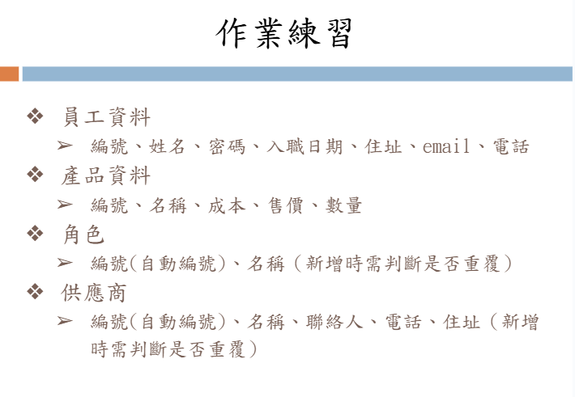

# 練習：員工資料的CRUD
## [v4.2.0] - 2025-03-23
### fixed
1. 修改資料庫結構，新結構如`sql`資料夾內的檔案

### improved
1. 優化程式邏輯，設置邏輯閥檢測【角色】、【供應商】中的[角色名稱]、[供應商地址]重複新增問題
## [v4.1.0] - 2025-03-10
### 部屬方式
1. 先到`sql`資料夾中下載最新版本資料庫檔案並匯入phpmyadmin
2. 將`index.css`檔案刪除或清空內容
3. 依自己需求將各前端顯示的頁面改為自己期望的名稱(因為我的都是跟賽車有關的)
### 更新內容
- 新增auto incurent功能，主key id將會自動新增
- 新增`產品資料`、`角色`、`供應商`三份資料表，對應欄位如下
     1. 產品資料`product`：編號`pid`(自動編號)、名稱`p_name`、成本`cost`、售價`price`、數量`stock`
     2. 角色`role`：編號`rid`(自動編號)、名稱`r_name`(新增時判斷是否重複)
     3. 供應商`supplier`：編號`sid`(自動編號)、名稱`s_name`、聯絡人`contact`、電話`tel`、住址`address`(新增時判斷是否重複)

    
## [v4] - 2025-03-10
- 這是一個練習，需要自行新增名為user的資料表，內有四個varchar欄位，分別為id、passowrd、email、phone
- 這個版本優化了前後端的寫法，是Week4的上課內容
- php class內部method功能若有大量重複部分，可獨立出private function，以便內部呼叫
- 簡單的if-else可以使用另一種寫法 ?expression-true : expression-flase

// 以下說明 "./", "../", "/../" 三種路徑表示法的差別

// 1. "./" 表示當前目錄
//    例如：如果當前目錄是 "/var/www/html"，
//    那麼 "./file.php" 就代表 "/var/www/html/file.php"
$exampleCurrent = "./file.php";

// 2. "../" 表示上一層目錄（父目錄）
//    例如：如果當前目錄是 "/var/www/html"，
//    那麼 "../file.php" 就代表 "/var/www/file.php"
$exampleParent = "../file.php";

// 3. "/../" 在絕對路徑中使用
//    "/" 代表根目錄，而 "/../" 表示從根目錄往上回退，但因為根目錄沒有父目錄，
//    所以 "/../" 的效果依然是根目錄。
//    在相對路徑中通常不直接使用 "/../"，而是用類似 __DIR__ . '/../somePath'
//    來從當前檔案所在目錄回退到上一層目錄
$exampleAbsolute = "/../";

// 範例：假設我們有一個檔案位於 "backend/vendor/Router.php"
// 且控制器檔案位於 "backend/app/Controllers/Product.php"
// 要從 Router.php 載入 Product.php，可以這麼寫：

// __DIR__ 會回傳當前檔案所在的目錄，這裡為 "backend/vendor"
// '/../' 代表從 "vendor" 回到上一層 "backend"
// 再加上 "app/Controllers/Product.php" 就可以正確定位到該檔案

## Postman 測試教學
1. 安裝並開啟 [Postman](https://www.postman.com/)。
2. 新增一個 **POST** 請求，URL 指向後端 `index.php` 所在路徑，例如：
   `http://localhost/backend/public/index.php?action=doLogin`。
3. 在 `Body` 欄位選擇 `x-www-form-urlencoded`，填入 `email` 及 `password` 參數後送出請求。
4. 成功後會收到包含 `token` 的 JSON 回應。接著可在其他受保護的路由於 `Headers` 新增 `Authorization: Bearer <token>` 進行測試。
